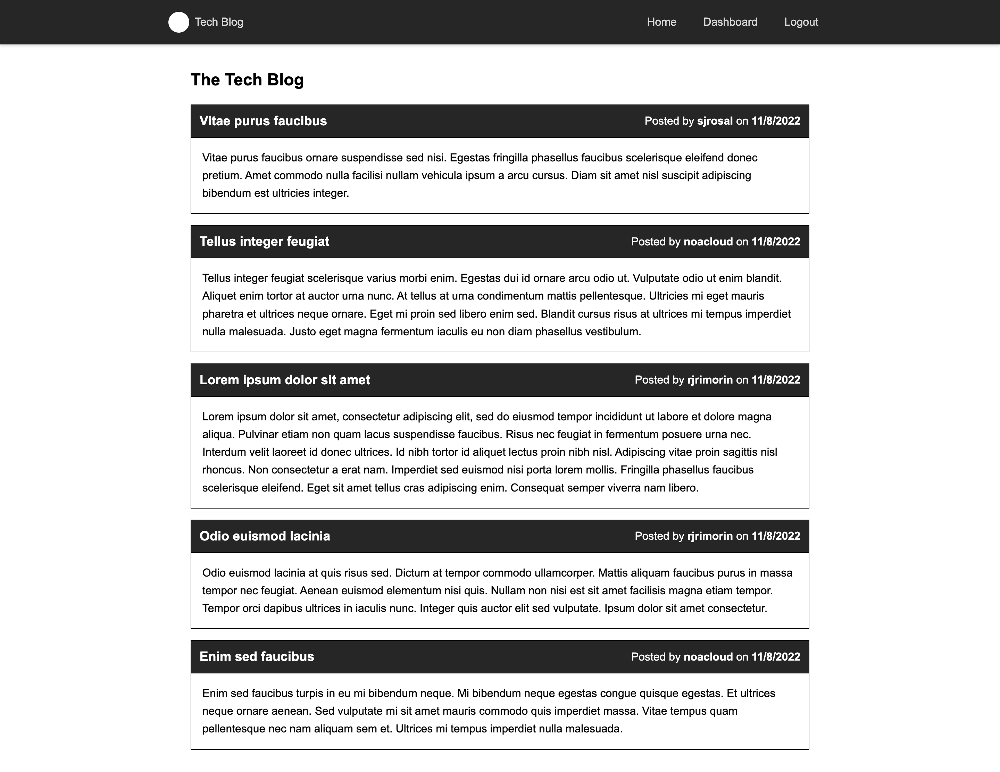
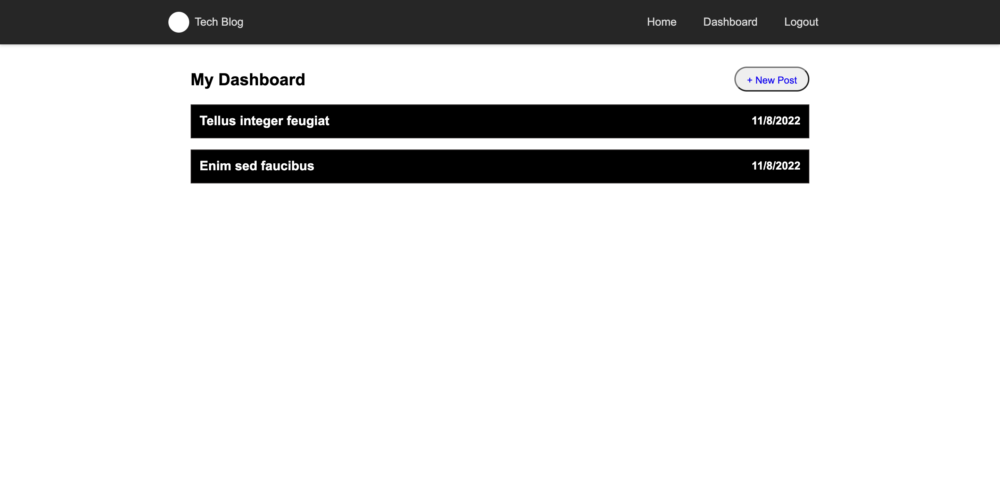
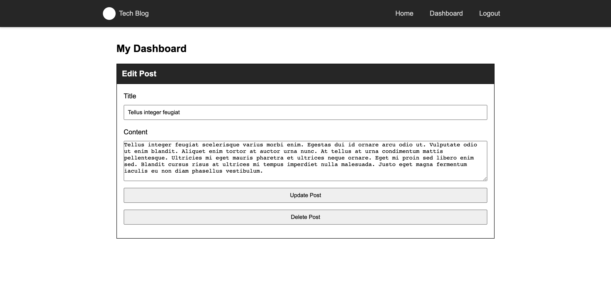
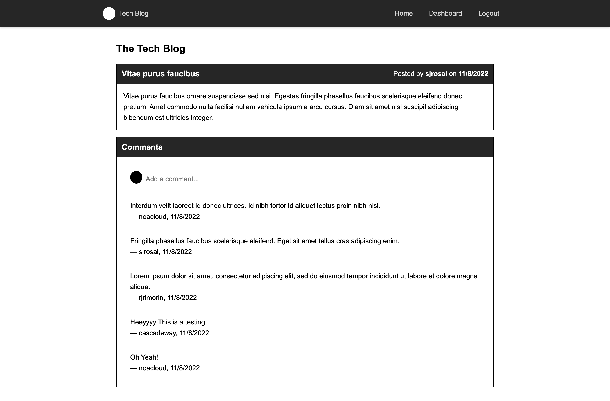
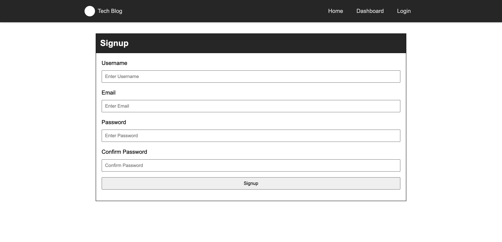
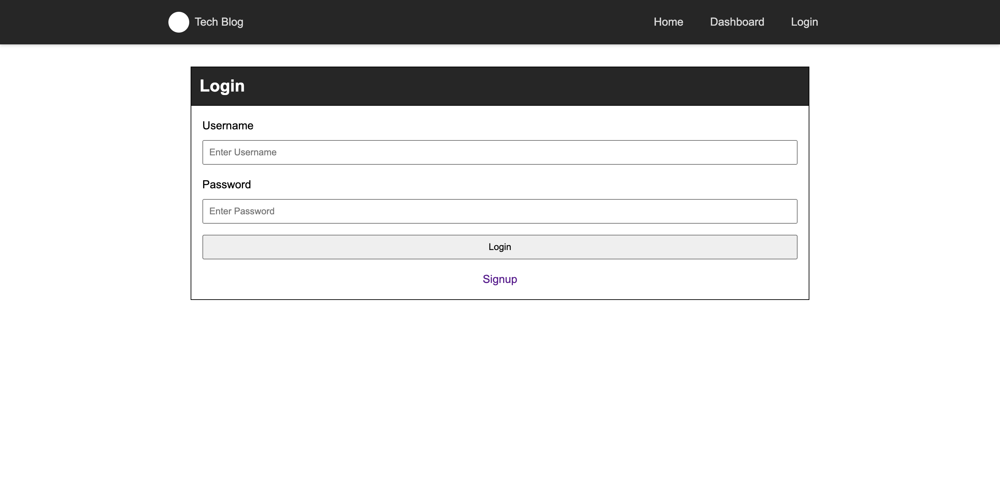

# Summer's Tech Blog

Welcome to my Tech Blog, for live demo click -> [Live Demo Here](https://summer-tech-blog.herokuapp.com/).

Create an account (Required to see dashboard functionality!)

## Installation

get the node package dependencies
`npm i`
update the file with your database credentials
`.env.EXAMPLE` to `.env`
In your mysql cli
run the script to generate the `blog_db` database using the `./db/schema.sql`
`npm run seed` to generate the tables and seeds
`npm run dev` to run the server with nodemon or
`npm run start` for a normal server start

## Screenshots

### Homepage

### Dashboard / CRUD for Posts

### Edit Post

### View Post and Comments

### Sign up

### Login

### Logout

# 
